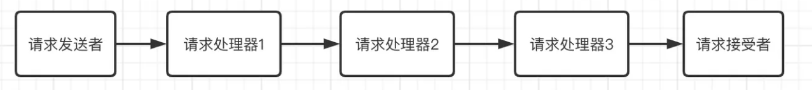
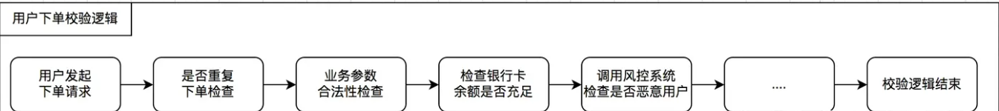

# design-patterns/README.MD

## 1.event-design-pattern
   
   事件设计模式，主要包含三个类，分别是事件Publisher、事件监听器listener、事件对象event。
   publisher主要负责事件的注册、触发、移除等功能。
      
      void registerListener(EventListener listener);

      void removeListener(EventListener listener);

      void notifyListener(AbstractEvent event);

   listener主要负责事件的回调处理

    public void onEvent(AbstractEvent event);

   event主要负责事件的传递，包含事件的类型、事件的源对象、事件的目标对象等信息。
    
    private String orderId;

    public String getOrderId() {
        return orderId;
    }

    public void setOrderId(String orderId) {
        this.orderId = orderId;
    }

    public OrderPayEvent(String name,String orderId) {
        super(name);
        this.orderId = orderId;
    }

   demo中例子主要是关于订单创建成功和支付成功后发送邮件和短信功能的事件模式的实现

   - event/normal 文件夹内是一个简单的事件设计模式的实现包含了事件的注册、触发、移除等功能。
   
   - event/spring 文件夹内是利用spring的ApplicationEventPublisher和ApplicationListener实现的事件设计模式。  
   > spring 模式中有两种实现方式，一种是继承ApplicationListener，一种是注解@EventListener。  
   > 只需要在监听器的回调方法onApplicationEvent() 上加上 @Async 注解就可以了。（启动类上需要添加 @EnableAsync 注解开启异步调用
   

## 2. state-design-pattern
> 状态模式，包含三种角色，分别是状态服务方角色，状态客户方角色，特定状态服务方角色，状态模式的宗旨是通过特定状态服务方，将原来属于状态服务方的多状态模式，转化为单状态模式，降低了状态服务的逻辑复杂度，提高了状态服务的可扩展性。

> 抽象下面5个类，分别是订单状态服务接口，订单状态服务抽象类，支付订单状态服务类，已发货订单状态服务类，收货订单状态服务类。
> OrderService 类调用状态接口类，处理对应的逻辑
~~~
// IOrderStateService：订单状态服务接口 
// AbstractOrderStateService：订单状态服务抽象类
// PayOrderStateService：支付订单状态服务类
// DeliveredOrderStateService：已发货订单状态服务类
// ReceiverOrderStateService：已收货订单状态服务类
~~~

1. OrderService：订单状态服务接口
~~~java
public interface IOrderService {

      /**
      * 创建订单
      */
      Order create();

      /**
      * 支付订单
      */
      Order pay(Order order);

      /**
      * 发货
      */
      Order deliver(Order order);

      /**
      * 完成订单
      */
      Order receive(Order order);
}

@Service
public class OrderServiceImpl implements IOrderService {

   private final List<IOrderStateService> orderStateServiceList;

   private Long BASE_ORDER_ID = 1L;

   public OrderServiceImpl(List<IOrderStateService> orderStateServiceList1) {
      this.orderStateServiceList = orderStateServiceList1;
   }

   @Override
   public Order create() {
      long orderId = BASE_ORDER_ID++;
      Order order = Order.builder().orderId(BASE_ORDER_ID++).stateEnums(OrderStateEnums.UNPAID)
              .build();
      System.out.println("订单创建成功，订单号为：" + orderId);
      return order;
   }

   @Override
   public Order pay(Order order) {
      orderStateServiceList.stream()
              .filter(orderStateService -> orderStateService.supportState(order.getStateEnums()))
              .findFirst().orElseThrow(() -> new RuntimeException("没有找到对应的状态")).pay(order);
      return order;
   }

   @Override
   public Order deliver(Order order) {
      orderStateServiceList.stream()
              .filter(iOrderStateService -> iOrderStateService.supportState(order.getStateEnums()))
              .findFirst().orElseThrow(() -> new RuntimeException("没有找到对应的状态")).deliver(order);
      return order;
   }

   @Override
   public Order receive(Order order) {
      orderStateServiceList.stream()
              .filter(iOrderStateService -> iOrderStateService.supportState(order.getStateEnums()))
              .findFirst().orElseThrow(() -> new RuntimeException("没有找到对应的状态")).receive(order);
      return order;
   }
}
~~~
2. orderStateService：订单状态服务抽象类
~~~java
public interface IOrderStateService {

    /**
     * 支付订单
     */
    void pay(Order order);

    /**
     * 发货
     */
    void deliver(Order order);

    /**
     * 完成订单
     */
    void receive(Order order);

    /**
     * 支持状态
     */
    boolean supportState(OrderStateEnums orderStateEnums);
}

@Service
public abstract class OrderAbstractStateServiceImpl implements IOrderStateService {

   @Override
   public void pay(Order order) {
      System.out.println( "OrderAbstractStateServiceImpl.pay" );
      throw new UnsupportedOperationException( "不支持支付操作" );
   }

   @Override
   public void deliver(Order order) {
      System.out.println( "OrderAbstractStateServiceImpl.deliver" );
      throw new UnsupportedOperationException( "不支持发货操作" );
   }

   @Override
   public void receive(Order order) {
      System.out.println( "OrderAbstractStateServiceImpl.receive" );
      throw new UnsupportedOperationException( "不支持收货操作" );
   }
}

@Service
public class PayOrderStateServiceImpl extends OrderAbstractStateServiceImpl {

   @Override
   public void pay(Order order) {
      order.setStateEnums( OrderStateEnums.PAID );
      System.out.println( "PayOrderStateServiceImpl.pay = " + order );
   }

   @Override
   public boolean supportState(OrderStateEnums orderStateEnums) {
      return OrderStateEnums.UNPAID.getCode().equals( orderStateEnums.getCode() );
   }
}

@Service
public class DeliverStateServiceImpl extends OrderAbstractStateServiceImpl {
   @Override
   public void deliver(Order order) {
      order.setStateEnums( OrderStateEnums.DELIVERED);
      System.out.println( "DeliverStateServiceImpl.deliver = " + order );
   }

   @Override
   public boolean supportState(OrderStateEnums stateEnums) {
      return OrderStateEnums.PAID.getCode().equals( stateEnums.getCode() );
   }
}

@Service
public class ReceiverStateServiceImpl extends OrderAbstractStateServiceImpl {

   @Override
   public void receive(Order order) {
      order.setStateEnums( OrderStateEnums.RECEIVED );
      System.out.println( "ReceiveStateServiceImpl.receive=" + order );
   }

   @Override
   public boolean supportState(OrderStateEnums orderStateEnums) {
      return OrderStateEnums.DELIVERED.getCode().equals( orderStateEnums.getCode() );
   }
}
~~~

## 3. responsibility-design-pattern
**一、什么是责任链模式？**  

责任链模式（Chain of Responsibility Pattern），顾名思义，为请求者和接受者之间创建一条对象处理链路，避免请求发送者与接收者耦合在一起！

责任链模式，是一种实用性非常强的设计模式，比较典型的应用场景有：

- Apache Tomcat 对 Encoding 编码处理的处理
- SpringBoot ⾥⾯的拦截器、过滤器链
- netty 中的处理链
- 支付风控的机制
- ⽇志处理级别

尤其是当程序的处理流程很长的时候，采用责任链设计模式，不仅实现优雅，而且易复用可扩展！

今天我们就一起来了解一下在 SpringBoot 中如何应用责任链模式！

### **二、代码实践**

我们以某下单流程为例，将其切成多个独立检查逻辑，采用责任链设计模式来编程，代码实践如下！

~~~

/**
 * order handler intercept.
 * @author z004dtzc
 */
public interface OrderHandlerIntercept {

    /**
     * order context.
     *
     * @param context context
     * @return order context
     */
    OrderContext handle(OrderContext context);

}

// 重复订单
@Component
@Slf4j
@Order(1)
public class RepeatOrderHandlerIntercept implements OrderHandlerIntercept {
    @Override
    public OrderContext handle(OrderContext context) {
        log.info("check weather repeat order");
        return context;
    }
}
//参数是否包含空
@Component
@Slf4j
@Order(2)
public class ParamOrderHandlerIntercept implements OrderHandlerIntercept {
    @Override
    public OrderContext handle(OrderContext context) {
        log.info("check weather contains blank param");
        return context;
    }
}

// 余额是否充足
@Component
@Slf4j
@Order(3)
public class BankOrderHandlerIntercept implements OrderHandlerIntercept {
    @Override
    public OrderContext handle(OrderContext context) {
        log.info("check weather bank is enough");
        return context;
    }
}

// 责任链的chain
@Component
@Slf4j
public class OrderInterceptChainService {

    private final List<OrderHandlerIntercept> handlerList;

    public OrderInterceptChainService(final List<OrderHandlerIntercept> handlerList) {
        this.handlerList = handlerList;
    }

    public OrderContext execute(OrderContext orderContext) {

        for (OrderHandlerIntercept handlerIntercept : handlerList) {
            orderContext = handlerIntercept.handle(orderContext);
        }
        return orderContext;
    }

}

// 测试类
@SpringBootTest
public class CalculatorServiceTest {

    @Autowired
    private OrderInterceptChainService orderInterceptChainService;

    @Test
    public void test() {
        orderInterceptChainService.execute(new OrderContext());
    }

}

~~~

## 4. factory-template-method-design-pattern

定义用户购物车接口IUserCart
~~~
public interface IUserCart {

    public Cart process(long userId, Map<Long, Integer> items);

    public int getUserType();
}
//定义抽象父类
public abstract class AbstractCart implements IUserCart{
    //处理购物车的大量重复逻辑在父类实现
    @Override
    public Cart process(long userId, Map<Long, Integer> items) {

        Cart cart = new Cart();

        List<Item> itemList = new ArrayList<>();
        items.entrySet().stream().forEach(entry -> {
            Item item = new Item();
            item.setId(entry.getKey());
            item.setPrice(new BigDecimal(10));
            item.setQuantity(entry.getValue());
            itemList.add(item);
        });
        cart.setItems(itemList);
        //让子类处理每一个商品的优惠  
        itemList.stream().forEach(item -> {
            processCouponPrice(userId, item);
            processDeliveryPrice(userId, item);
        });
        //计算商品总价  
        cart.setTotalItemPrice(cart.getItems().stream().map(item -> item.getPrice().multiply(BigDecimal.valueOf(item.getQuantity()))).reduce(BigDecimal.ZERO, BigDecimal::add));
        //计算总运费  
        cart.setTotalDeliveryPrice(cart.getItems().stream().map(Item::getDeliveryPrice).reduce(BigDecimal.ZERO, BigDecimal::add));
        //计算总折扣  
        cart.setTotalDiscount(cart.getItems().stream().map(Item::getCouponPrice).reduce(BigDecimal.ZERO, BigDecimal::add));
        //计算应付价格  
        cart.setPayPrice(cart.getTotalItemPrice().add(cart.getTotalDeliveryPrice()).subtract(cart.getTotalDiscount()));
        return cart;
    }

    //处理商品优惠的逻辑留给子类实现  
    protected abstract void processCouponPrice(long userId, Item item);

    //处理配送费的逻辑留给子类实现  
    protected abstract void processDeliveryPrice(long userId, Item item);
}  
~~~
定义具体类型的子类
~~~
@Service(value = "InternalUserCart")
@Slf4j
public class InternalUserCart extends AbstractCart {  
    @Override  
    protected void processCouponPrice(long userId, Item item) {
        log.info("processCouponPrice->InternalUserCart");
        item.setCouponPrice(BigDecimal.ZERO);
    }  
  
    @Override  
    protected void processDeliveryPrice(long userId, Item item) {  
        item.setDeliveryPrice(BigDecimal.ZERO);  
    }

    @Override
    public int supportUserType() {
        return 1;
    }
}

@Service(value = "NormalUserCart")
@Slf4j
public class NormalUserCart extends AbstractCart {  
  
    @Override  
    protected void processCouponPrice(long userId, Item item) {
        log.info("processCouponPrice->NormalUserCart");
        item.setCouponPrice(BigDecimal.ZERO);
    }  
  
    @Override  
    protected void processDeliveryPrice(long userId, Item item) {  
        item.setDeliveryPrice(item.getPrice()  
                .multiply(BigDecimal.valueOf(item.getQuantity()))  
                .multiply(new BigDecimal("0.1")));  
    }

    @Override
    public int supportUserType() {
        return 2;
    }
}

@Service(value = "VipUserCart")
@Slf4j
public class VipUserCart extends AbstractCart {

    @Override
    protected void processCouponPrice(long userId, Item item) {
        log.info("processCouponPrice->VipUserCart");
        if (item.getQuantity() > 2) {
            item.setCouponPrice(item.getPrice()
                    .multiply(BigDecimal.valueOf(100 - 40).divide(new BigDecimal("100")))
                    .multiply(BigDecimal.valueOf(item.getQuantity() - 2)));
        } else {
            item.setCouponPrice(BigDecimal.ZERO);
        }
    }

    @Override
    protected void processDeliveryPrice(long userId, Item item) {
        item.setDeliveryPrice(BigDecimal.ZERO);
    }

    @Override
    public int supportUserType() {
        return 3;
    }
}
~~~
测试类

~~~
@SpringBootTest
class FactoryTemplateMethodApplicationTests {

    @Autowired
    private List<IUserCart> userCartList;

    @Test
    public void addCart() {
        int userType = 1;
        long userId = 1;
        Map<Long, Integer> itemMap = new HashMap<>();
        itemMap.put(1L, 2);
        Optional.ofNullable(userCartList)
                .map(cartList -> cartList.stream()
                        .filter(cart -> cart.supportUserType() == userType)
                        .collect(Collectors.toList())).orElseThrow(() -> new IllegalArgumentException("")).forEach(cart -> cart.process(userId, itemMap));

    }

}
~~~

## 5.  策略模式（Strategy Pattern）

詳見内部strategy 模块

