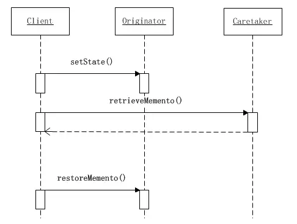

## 定义 ##

**备忘录模式又叫做快照模式(Snapshot Pattern)或Token模式，是对象的行为模式。**

**备忘录对象是一个用来存储另外一个对象内部状态的快照的对象。备忘录模式的用意是在不破坏封装的条件下，将一个对象的状态捕捉(Capture)住，并外部化，存储起来，从而可以在将来合适的时候把这个对象还原到存储起来的状态，备忘录模式常常与命令模式和迭代子模式一同使用。**

## 备忘录模式的结构 ##

备忘录模式的结构图如下所示：


备忘录模式的结构

备忘录模式所涉及的角色有三个：**备忘录角色(Memonto)**、**发起人角色(Originator)**、**负责人角色(Caretaker)**。

### 备忘录角色(Memento) ###

备忘录角色有如下责任：

1. 将发起人(Originator)对象的内部状态存储起来。备忘录可以根据发起人对象的判断来决定存储多少个发起人(Originator)对象的内部状态。
2. 备忘录可以保护其内容不被发起人(Originator)对象之外的任何对象所读取。

备忘录有两个等效的接口：

- **窄接口**：负责人(Caretaker)对象（和其他出发起人对象之外的任何对象）看到的是备忘录的窄接口(narror Interface)，这个窄接口只允许他把备忘录对象传给其他的对象。
- **宽接口**：与负责人看到的窄接口相反的是，发起人对象可以看到一个宽接口(wide Interface)，这个宽接口允许它读取所有的数据，以便根据这些数据恢复这个发起人对象的内部状态。

### 发起人角色(Originator) ###

发起人角色有如下责任：

1. 创建一个含有当前内部状态的备忘录对象
2. 使用备忘录对象存储其内部状态。

### 负责人角色(Caretaker) ###

负责人角色有如下责任：

1. 负责保存备忘录对象。
2. 不检查备忘录对象的内容

## “白箱”备忘录模式的实现 ##

备忘录角色对任何对象都提供一个接口，即宽接口，备忘录角色的内部所存储的状态就对所有对象公开。因此这个实现又叫做“白箱实现”。

“白箱”实现将发起人角色的状态存储在一个大家都看得到的地方，因此是破坏封装性的。但是通过程序员自律，同样可以在一定程度上实现模式的大部分用意。因此白箱实现的仍然是有意义的。

下面给出一个示意性的“白箱实现”


示意性的白箱实现

### 示例代码 ###

备忘录角色类，备忘录对象将发起人对象传入的状态存储起来。


```cpp
public class Memento {
    private String state;
    
    public Memento(String state) {
        this.state = state;
    }

    public String getState() {
        return state;
    }

    public void setState(String state) {
        this.state = state;
    }
}
```

发起人角色类，发起人角色利用一个新创建的备忘录对象将自己的内部状态存储起来。


```csharp
public class Originator {
    private String state;
    /**
     * 工厂方法，返回一个新的备忘录对象
     * @return
     */
    public Memento createMemento() {
        return new Memento(state);
    }
    /**
     * 将发起人的状态恢复到备忘录对象所记录的状态
     * @param memento
     */
    public void restoreMemento(Memento memento) {
        this.state = memento.getState();
    }
    public String getState() {
        return state;
    }
    public void setState(String state) {
        this.state = state;
        System.out.println("当前状态：" + this.state);
    }
}
```

负责人角色类，负责人角色类负责保存备忘录对象，但是从不修改（甚至不查看）备忘录对象的内容。


```cpp
public class Caretaker {
    private Memento memento;
    /**
     * 备忘录的取值方法
     * @return
     */
    public Memento retrieveMenento() {
        return this.memento;
    }
    /**
     * 备忘录的赋值方法
     * @param memento
     */
    public void saveMemento(Memento memento) {
        this.memento = memento;
    }
}
```

客户端角色类


```csharp
public class Client {
    public static void main(String[] args) {
        Originator originator = new Originator();
        Caretaker caretaker = new Caretaker();
        //改变发起人对象的状态
        originator.setState("On");
        //创建备忘录对象，并将发起人对象的状态存储起来
        caretaker.saveMemento(originator.createMemento());
        //修改发起人对象的状态
        originator.setState("Off");
        //恢复发起人对象的状态
        originator.restoreMemento(caretaker.retrieveMenento());
        
        //发起人对象的状态
        System.out.println("发起人对象的当前状态为：" + originator.getState());
    }
}
```

从上面的这个示意性的客户端角色里面，首先将发起人对象的状态设置成“On”，并创建一个备忘录对象将这个状态存储起来；然后将发起人对象的状态更改为“Off”；最后将发起人对象的状态恢复到备忘录对象所存储起来的状态，即“On”状态。

系统的时序图更能够反映出系统中各个角色被调用的时间顺序。如下图是将发起人对象的状态存储到白箱备忘录对象中的时序图。


发起人对象存储状态到备忘录对象的时序图

可以看出系统运行的时序是这样的：

1. 将发起人对象的状态设置为“On”。
2. 调用发起人角色的`createMemento()`方法，创建一个备忘录的对象将这个状态存储起来。
3. 将备忘录对象存储到负责人对象中去。

**将发起人对象恢复到备忘录对象中所记录的状态的时序图如下所示：**



将发起人对象恢复到备忘录对象中所记录的状态的时序图

1. 将发起人的状态设置成“Off”。
2. 将备忘录对象从负责人对象中取出。
3. 将发起人对象恢复到备忘录对象存储的状态，也就是发起人对象的“On”状态。

## “黑箱”备忘录模式的实现 ##

备忘录角色对发起人`Originator`角色对象提供一个宽接口，而为其他对象提供一个窄接口。这样的实现叫做“黑箱实现”。

在Java语言中，实现双重接口的办法就是讲**备忘录角色类**设计成**发起人角色类**的内部成员类。

将`Memento`设成`Originator`类的内部类，从而将`Memento`对象封装在`Originator`里面；在外面提供一个标识接口`MementoIF`给`Caretaker`及其他对象。这样`Originator`类看到的是`Memento`所有的接口，而`Caretaker`吉其他对象看到的仅仅是标识接口`MementoIF`所暴露出来的借口。

使用内部类实现备忘录模式的类图如下所示：


使用内部类实现备忘录模式的类图

### 示例代码 ###

窄接口`MementoIF`，这是一个标识接口，因此没有定义出任何的方法。


```csharp
public interface MementoIF {

}
```

发起人角色类`Originator`中定义了一个内部类`Memento`，由此`Memento`类的全部接口都是私有的，因此只有它自己和发起人角色对象类可以调用。


```java
public class Originator {
    private String state;
    /**
     * 将发起人的状态恢复到备忘录对象所记录的状态
     * @param memento
     */
    public void restoreMemento(MementoIF memento) {
        this.state = ((Memento)memento).getState();
    }
    public String getState() {
        return state;
    }
    public void setState(String state) {
        this.state = state;
        System.out.println("当前状态：" + this.state);
    }

    /**
     * 工厂方法，返回一个新的备忘录对象
     * @return
     */
    public MementoIF createMemento() {
        return new Memento(this.state);
    }
    
    private class Memento implements MementoIF {
        private String state;
        /**
         * 构造方法
         * @param state
         */
        private Memento(String state) {
            this.state = state;
        }

        public String getState() {
            return state;
        }

        public void setState(String state) {
            this.state = state;
        }
    }
}
```

负责人角色类`Caretaker`能够得到的备忘录对象是以`MementoIF`为接口的，由于这个接口仅仅是一个标识接口，因此负责人角色不可能改变这个备忘录对象的内容。


```cpp
public class Caretaker {
    private MementoIF memento;
    /**
     * 备忘录的取值方法
     * @return
     */
    public MementoIF retrieveMenento() {
        return this.memento;
    }
    /**
     * 备忘录的赋值方法
     * @param memento
     */
    public void saveMemento(MementoIF memento) {
        this.memento = memento;
    }
}
```

客户端角色类


```csharp
public class Client {
    public static void main(String[] args) {
        Originator originator = new Originator();
        Caretaker caretaker = new Caretaker();
        //改变发起人对象的状态
        originator.setState("On");
        //创建备忘录对象，并将发起人对象的状态存储起来
        caretaker.saveMemento(originator.createMemento());
        //修改发起人对象的状态
        originator.setState("Off");
        //恢复发起人对象的状态
        originator.restoreMemento(caretaker.retrieveMenento());
        
        //发起人对象的状态
        System.out.println("发起人对象的当前状态为：" + originator.getState());
    }
}
```

执行流程为：

1. 客户端首先将发起人角色的状态设置为“On”；
2. 然后调用发起人角色的`createMemento()`方法，创建一个备忘录对象将发起人角色的状态存储起来(这个方法返回一个`MementoIF`接口，真实的数据类型为`Originator`内部类的`Memento`对象)。
3. 将备忘录对象存储到负责人对象中去，由于负责人对象存储的仅仅是`MementoIF`接口，因此无法获取备忘录对象内部存储的状态。
4. 将发起人对象的状态设置为“Off”。
5. 调用负责人对象的`restoreMemento()`方法将备忘录对象取出。注意，此时仅能或得到的返回结果为`MementoIF`接口，因此无法读取此对象的内部状态。
6. 调用发起人对象的`retrieveMenento()`方法将发起人对象的状态恢复到备忘录对象存储的状态上，也就是“On”状态。由于发起人对象的内部类`Memento`实现了`MementoIF`接口，这个内部类是传入的备忘录对象的真实类型，因此发起人对象可以利用内部类`Memento`的私有接口读出此对象的内部状态。

## 多重检查点 ##

前面所给出的白箱和黑箱的示意性实现都是只存储一个状态的简单实现，也可以叫做只有一个检查点。常见的系统往往需要存储不止一个状态，而是需要存储多个状态，或者叫做多个检查点。

备忘录模式可以将发起人对象的状态存储到备忘录对象里面，备忘录模式可以将发起人对象恢复到备忘录对象所存储的某一个检查点上。下面给出一个示意性的、有多重检查点的备忘录模式的实现。


有多重检查点的备忘录模式的实现

### 示例代码 ###

备忘录角色类，这个实现可以存储任意多的状态，外界可以使用检查点指数index来取出检查点上的状态：


```java
public class Memento {
    private List<String> states;
    private int index;
    /**
     * 构造方法
     * @param states
     * @param index
     */
    public Memento(List<String> states, int index) {
        //该处需要注意，我们在这里重新构建了一个新的集合，拷贝状态集合到新的集合中，保证原有集合变化不会影响到我们记录的值
        this.states = new ArrayList<>(states);
        this.index = index;
    }
    public List<String> getStates() {
        return states;
    }
    public int getIndex() {
        return index;
    }
}
```

发起人角色


```csharp
public class Originator {
    private List<String> states;
    //检查点序号
    private int index;
    /**
     * 构造函数
     */
    public Originator() {
        this.states = new ArrayList<>();
        index = 0;
    }
    /**
     * 工厂方法，返回一个新的备忘录对象
     * @return
     */
    public Memento createMemento() {
        return new Memento(states, index);
    }
    /**
     * 将发起人恢复到备忘录对象记录的状态上。
     * @param memento
     */
    public void restoreMemento(Memento memento) {
        this.states = memento.getStates();
        this.index = memento.getIndex();
    }
    /**
     * 状态的赋值方法
     * @param state
     */
    public void setState(String state) {
        this.states.add(state);
        this.index++;
    }
    public List<String> getStates() {
        return states;
    }
    /**
     * 辅助方法，打印所有状态
     */
    public void pringStates() {
        System.out.println("当前检查点共有：" + states.size() + "个状态值");
        for (String state : states) {
            System.out.println(state);
        }
    }
}
```

负责人角色类


```csharp
public class Caretaker {
    private Originator originator;
    private List<Memento> mementos = new ArrayList<>();
    private int current;
    /**
     * 构造函数
     * @param originator
     */
    public Caretaker(Originator originator) {
        this.originator = originator;
        this.current = 0;
    }
    /**
     * 创建一个新的检查点
     * @return
     */
    public int createMemento() {
        Memento memento = this.originator.createMemento();
        this.mementos.add(memento);
        return this.current++;
    }
    /**
     * 将发起人对象状态恢复到某一个检查点
     * @param index
     */
    public void restoreMemento(int index) {
        Memento memento = mementos.get(index);
        originator.restoreMemento(memento);
    }
    /**
     * 将某一个检查点删除
     * @param index
     */
    public void removeMemento(int index) {
        mementos.remove(index);
    }
    public void printAll() {
        for (int i = 0; i < mementos.size(); i++) {
            System.out.println("index i : " + i + " : " + mementos.get(i) + " : " + mementos.get(i).getStates());
            System.out.println("---------------------------------");
        }
    }
}
```

客户端角色类


```csharp
public class Client {
    public static void main(String[] args) {
        Originator originator = new Originator();
        Caretaker caretaker = new Caretaker(originator);
        //改变状态
        originator.setState("State 0");
        //建立一个检查点
        caretaker.createMemento();
        //改变状态
        originator.setState("State 1");
        //建立一个检查点
        caretaker.createMemento();
        //改变状态
        originator.setState("State 2");;
        //建立一个检查点
        caretaker.createMemento();
        //改变状态
        originator.setState("State 3");
        //建立一个检查点
        caretaker.createMemento();
        //改变状态
        originator.setState("State 4");
        //建立一个检查点
        caretaker.createMemento();
        //打印出所有的检查点
        originator.pringStates();
        System.out.println("---------恢复状态到某一个检查点----------");
        //恢复到第二个检查点
        caretaker.restoreMemento(1);
        //打印出所有的检查点.
        originator.pringStates();
    }
}
```

运行结果如下：


```undefined
当前检查点共有：5个状态值
State 0
State 1
State 2
State 3
State 4
---------恢复状态到某一个检查点----------
当前检查点共有：2个状态值
State 0
State 1
```

可以看出，客户端角色通过不断改变发起人角色的状态，并将之存储在备忘录角色里面。通过指明检查点指数可以将发起人角色恢复到相应检查点所对应的状态上。

将发起人的状态存储到备忘录对象中的时序图如下：


将发起人的状态存储到备忘录对象中的时序图

系统运行时的时序是这样的：

1. 将发起人的状态设置为某个有效状态，发起人会记录当前已经设置的状态值列表
2. 调用负责人角色的`createMemento()`方法创建备忘录角色存储点，在该方法中，会调用发起人角色的`createMemento()`创建一个备忘录对象，记录当时发起人对象中的状态值列表和序号。然后负责人角色对象将发起人对象返回的备忘录对象存储起来。

**将发起人对象恢复到某一个检查点备忘录对象的时序图如下：**


将发起人对象恢复到某一个检查点备忘录对象的时序图

由于负责人角色的功能被增强了，因此将发起人对象恢复到备忘录对象所记录的状态时，系统运行的时序被简化了。

1. 调用负责人对象的`restoreMemento()`方法，指定恢复到的检查点。
2. 负责人对象从存储的备忘录对象列表中获取相应检查点位置的备忘录对象，调用发起人对象的`restoreMemento()`方法
3. 在方法内将备忘录中保存的状态集合和序号恢复到发起人对象上。

## "自述历史"模式 ##

所谓“自述历史”模式(History-On-Self Pattern)实际上就是备忘录模式的一个变种。在备忘录模式中，发起人角色`Originator`、负责人角色`Caretaker`和备忘录角色`Mementor`都是独立的角色。虽然在实现上备忘录角色类可以成为发起人角色类的内部成员类，但是备忘录角色类仍然保持作为一个角色的独立意义。

在“自述历史”模式里面，发起人角色自己兼任负责人角色。

“自述历史”模式的类图如下所示：


“自述历史”模式的类图

**备忘录角色有如下责任：**

1. 将发起人对象`Originator`的内部状态存储起来。
2. 备忘录角色可以保护其内容不被发起人`Originator`对象之外的任何对象所读取。

**发起人角色有如下责任：**

1. 创建一个含有它当前的内部状态的备忘录对象。
2. 使用备忘录对象存储其内部状态。

客户端角色有负责保护备忘录对象的责任。

### 示例代码 ###

窄接口`MementoIF`，这是一个标识接口，因此没有定义任何方法


```csharp
public interface MementoIF {

}
```

发起人角色类，发起人角色同时还要兼任负责人角色，也就是说她自己负责保持自己的备忘录对象。


```java
public class Originator {
    private String state;
    /**
     * 状态变更
     * @param state
     */
    public void changeState(String state) {
        this.state = state;
        System.out.println("状态改变为：" + this.state);
    }
    /**
     * 工厂方法，返回一个新的备忘录对象
     * @return
     */
    public Memento createMemento() {
        return new Memento(this);
    }
    /**
     * 将发起人状态恢复到备忘录对象所记录的状态上
     * @param memento
     */
    public void restoreMemento(MementoIF memento) {
        changeState(((Memento)memento).getState());
    }
    public class Memento implements MementoIF {
        private String state;
        /**
         * 构造方法
         * @param state
         */
        private Memento(Originator originator) {
            this.state = originator.state;
        }
        private String getState() {
            return this.state;
        }
    }
}
```

客户端角色类


```cpp
public class Client {
    public static void main(String[] args) {
        Originator originator = new Originator();
        //修改状态
        originator.changeState("State 0");
        //创建备忘录
        MementoIF memento = originator.createMemento();
        //修改状态
        originator.changeState("State 1");
        //按照备忘录对象存储的状态恢复发起人对象的状态
        originator.restoreMemento(memento);
    }
}
```

由于“自述历史”作为一个备忘录模式的特殊实现，实现形式非常简单易懂，因此它可能是备忘录模式最为流行的实现形式。

文章参考作者：

作者：步积
链接：https://www.jianshu.com/p/9ac45604c5f8

